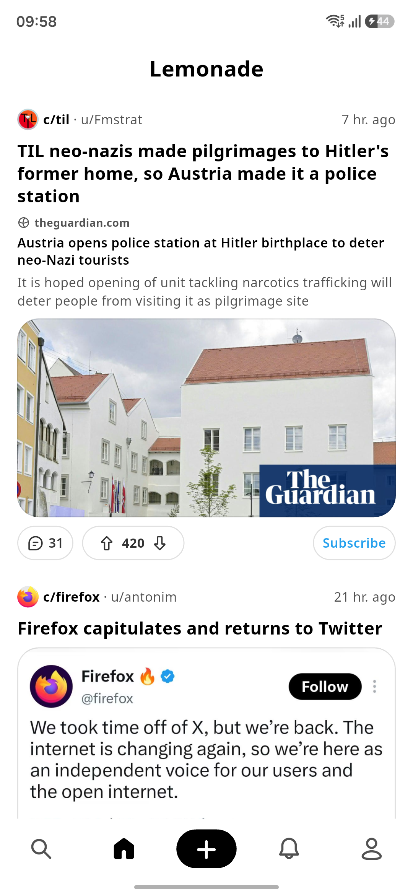
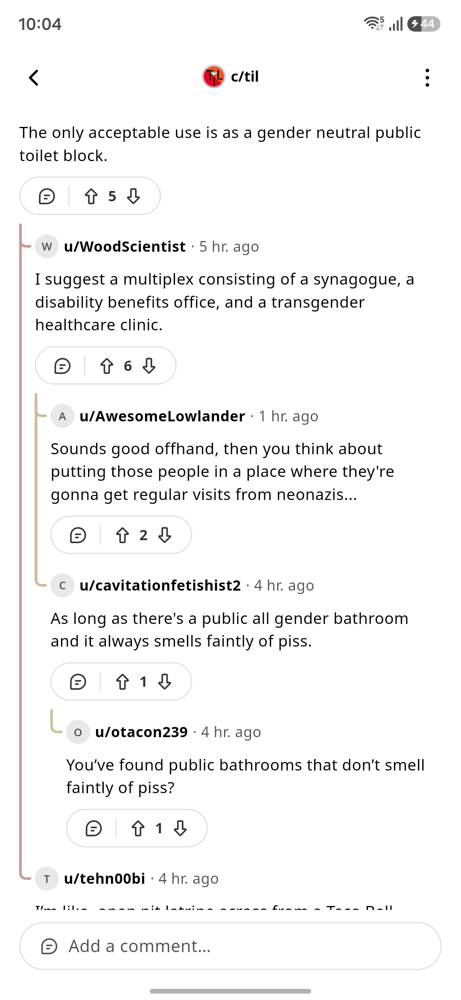
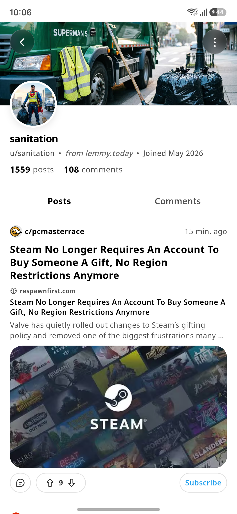
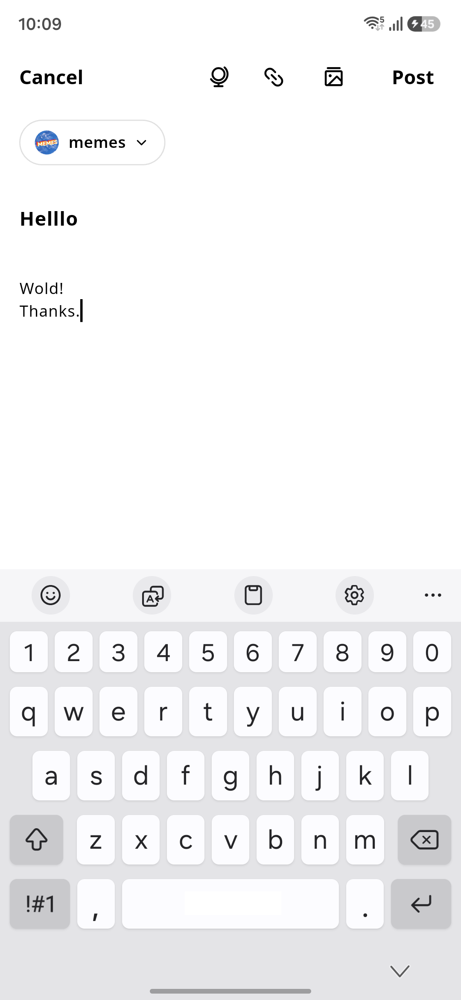
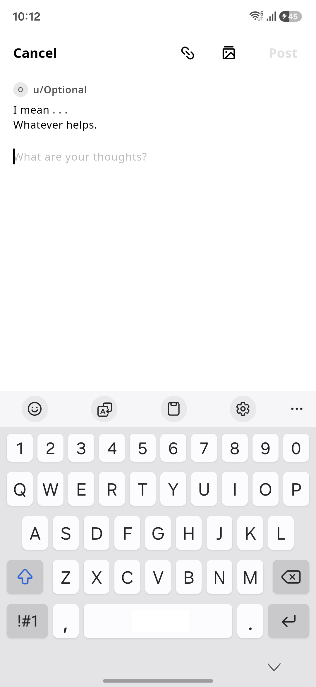
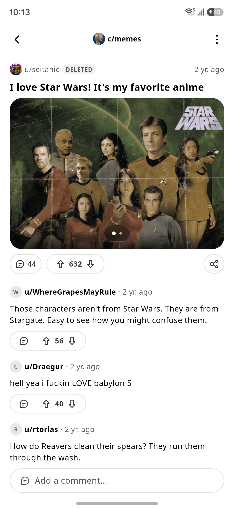
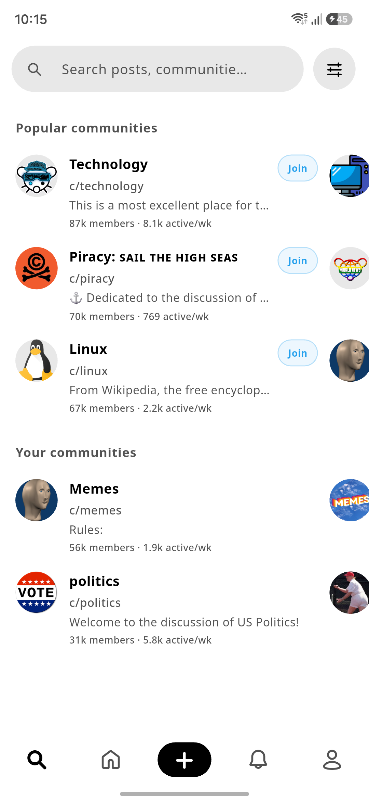

# Lemonade

A Flutter client for [Lemmy](https://join-lemmy.org) with a clean, minimal, and simple interface.

---

## Screenshots

<p align="center">
  
  
  
</p>
<p align="center">
  
  
  
</p>
<p align="center">
  
  
  
</p>

---

## Getting Started

```bash
flutter run
```

---

## Configuration (Optional)

To configure production AdMob, RevenueCat, or custom support email:

1. Copy [`config.example.json`](config.example.json) to `config.json`:
   ```bash
   cp config.example.json config.json
   ```
2. Fill in your keys in `config.json`.
3. Run with:
   ```bash
   flutter run --dart-define-from-file=config.json
   ```

---

## Release Build

For building a signed Android App Bundle (AAB):
```bash
flutter build appbundle --release --dart-define-from-file=config.json
```
*(Signing keys are configured in `android/key.properties`, see [`android/key.properties.example`](android/key.properties.example)).*

---

## License

GNU General Public License v3.0 (GPL-3.0). See [LICENSE](LICENSE).

*App branding and logo in `assets/branding/` are proprietary trademarks.*

---

## Contributors LLMs

This project is developed with assistance from various large language models (LLMs).
