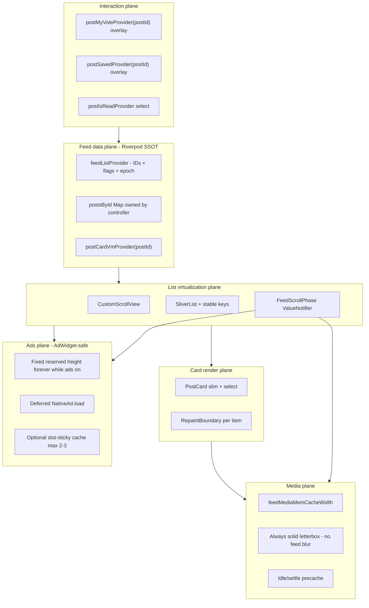
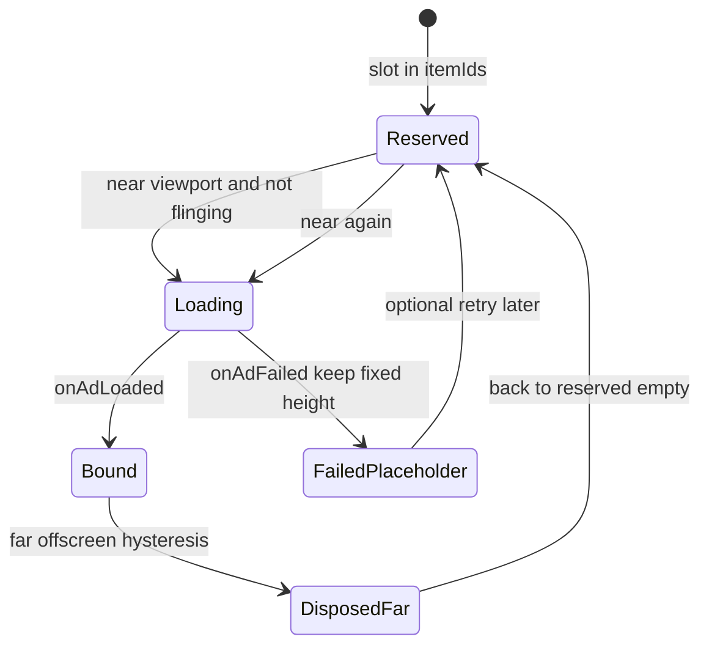
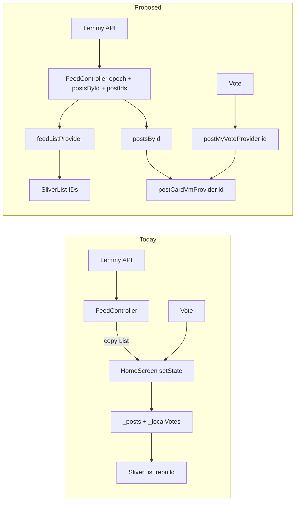
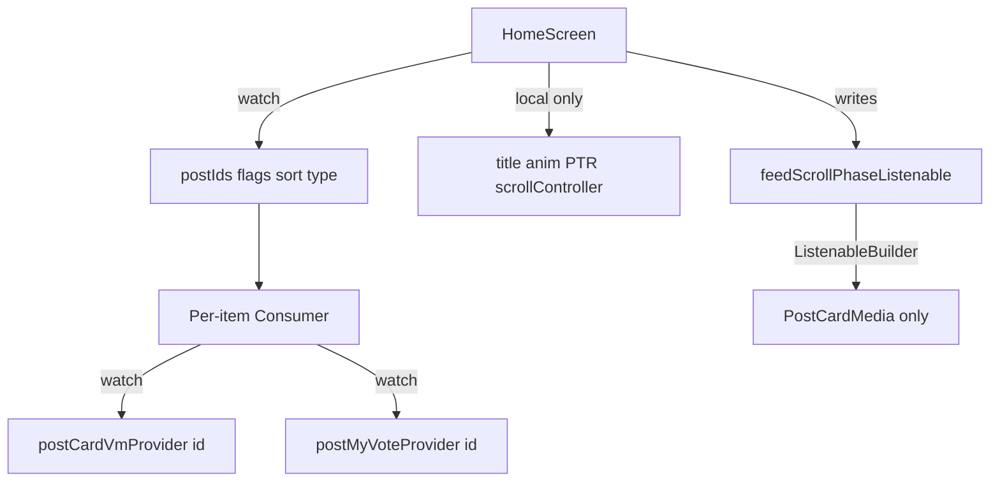
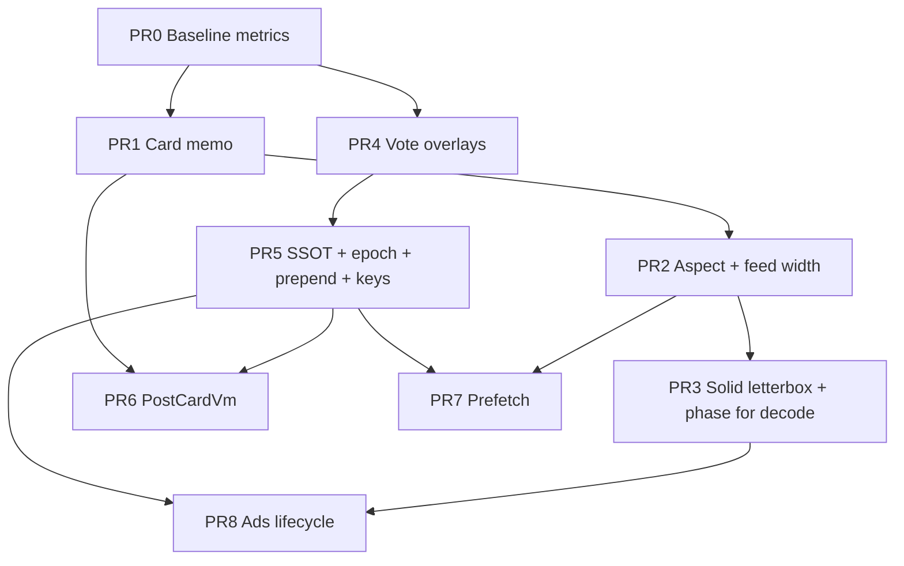

# Home Feed Smooth Scroll Architecture Redesign

| Field | Value |
|-------|-------|
| **Document** | Home Feed Smooth Scroll Architecture Redesign |
| **Author** | Engineering (draft for review) |
| **Date** | 2026-07-25 |
| **Status** | Implemented (rev 6 — fling fidelity / proxy rows 2026-07-28) |
| **App** | Bluerum / Lemonade (Flutter + Riverpod Lemmy client) |
| **Primary platform** | Android (Impeller) |
| **Workspace** | `C:\Users\nguye\mycodes\bluerum` |

---

## Vietnamese executive summary (tóm tắt)

**Rev 7 (2026-08-01):** App-wide post-list parity — siblings (Community / Profile / Search / Saved) dùng `maxKeptRows: 0` + idle-only precache + 180ms load-more debounce như Home. Fling **proxy rows retired** (blank flash); `FeedPostProxyTile` chỉ còn helper/test. cacheExtent **480** (không 1400).

**Rev 6 (2026-07-28):** Fidelity plane thử proxy mid-fling — **đã rút**. Avatar `deferWhileScrolling` trên feed; body preview plain `Text`; precache **idle-only**; ads **không** `NativeAd.load` mid-fling.

**Rev 5 (2026-07-25):** Waves A–C + portable post-detail wins đã ship. SSOT Riverpod, `PostCardVm`, solid letterbox, deferred ads fixed-height, vote overlay per-id, scroll phase, **ScrollStable feed images**, pure virtualize, **idle load-more**, **O(1) findChildIndex**, measured-height prefetch.

**Lịch sử pain (đã xử lý):** dual state Home + controller; markdown mỗi build; `ImageFiltered` letterbox; ads co chiều cao; precache khi fling; CNI không gate scroll trên feed card; **full PostCard mount mid-fling (rev 6 proxy)**.

---

## Overview

The home feed (`HomeScreen` → `CustomScrollView` / `SliverList` → `PostCard` + `InFeedNativeAd`) does not scroll at commercial-app quality. Profile-level jank is structural, not cosmetic: dual ownership of feed state, whole-tree rebuilds on per-post mutations, CPU work on the card build path (markdown AST, media extraction), GPU cost under every media card (blur + progressive dual-decode), inaccurate scroll-index estimation for prefetch, and platform-view native ads created as soon as slots enter the builder cache.

This document redesigns the feed into six coordinated planes—**data**, **list virtualization**, **card render**, **media**, **ads**, and **interaction**—so that fling frames stay under budget (~16.7 ms at 60 Hz / ~11.1 ms at 90 Hz stretch) on mid-range Android. Product decisions (rev 4): **home feed letterbox is always solid** (no frosted `ImageFiltered` blur on feed) and **ad slots keep fixed reserved height forever while ads are enabled**. The approach is incremental: capture baselines first (PR0), isolate card hot path, move Home to Riverpod SSOT with an explicit store/vote-overlay contract, then harden media and ads—without a big-bang rewrite or a mandatory third-party list package.

**Implementability note**: Wave A (card memo, aspect lock, phase media) is fully specified. Wave B/C require the **Store contract**, **generation/epoch API**, **ads lifecycle (no illegal AdWidget reuse)**, and the **Implementation appendix** in this revision—engineers should not invent alternate store patterns.

---

## Background & Motivation

### Product context

- **App**: Bluerum / Lemonade — Flutter client for Lemmy-like federated social.
- **Stack**: Flutter + Riverpod 3, `CustomScrollView`/`SliverList`, `cached_network_image`, Google Mobile Ads native templates, SharedPreferences for sort/type.
- **UX bar**: Instagram / Reddit / X-class scroll smoothness on mid-range Android devices.

### Current state (verified in code)

| Area | Location | Behavior today |
|------|----------|----------------|
| Entry / chrome | `lib/features/feed/presentation/home_screen.dart` (**938** lines) | Owns local `_posts`, loading flags, `_localVotes` / `_localSaves`; copies from `feedControllerProvider` after load/loadMore via `setState` |
| Controller | `lib/features/feed/presentation/feed_controller.dart` | Has `FeedState` with **dead** `votes`/`saves` maps (only reset to `{}` on `load`, never written); HomeScreen does **not** watch controller for UI |
| List | `home_screen.dart` `CustomScrollView` + `SliverList` + `SliverChildBuilderDelegate` | Lazy builder exists; **no** `findChildIndexCallback`; `cacheExtent: 1200`; load-more when `extentAfter <= max(2400, viewport*4)` |
| Ads | `ads_placement.dart`, `in_feed_native_ad.dart`, `AdsConfig.homePostsPerAd = 6` | Interleaved via pure helpers; each slot constructs a `NativeAd` in `initState` and collapses to `SizedBox.shrink()` on failure (layout jump); key uses list index |
| Card | `lib/shared/widgets/post/post_card.dart` (**1213** lines) | `ConsumerStatefulWidget`; watches global session sets; `markdownToPlainText` every build; `TapGestureRecognizer` per build; dynamic aspect ratio via `ImageStreamListener`; `BlurredImageBackground` + `BackdropFilter` |
| Media | `media_precache.dart`, `network_media_image.dart`, `bootstrap.dart` | **Single** `mediaMemCacheWidth` for feed+detail (intentional cache-key match); ImageCache max 250 / 96 MB; dual precache loops (card + thumb + full-res) during scroll |
| Shell | `main_shell.dart` + `shell_chrome.dart` | Scroll hide is 1:1 via `NotificationListener` — acceptable; not the primary jank source |
| Prepend bug | `main_shell.dart` → `prependPost`; Home does not `watch` posts | **Create-post prepend is invisible on Home until a later reload** — dual-state fallout, not just a footnote |

### Pain points

1. **Whole-screen rebuild on vote/save/loadMore** — `_toggleUpvote` / `_toggleSave` call `setState` on `HomeScreenState`, rebuilding **built** children in `cacheExtent` (~3–8 cards + ads), not every logical row.
2. **Hot-path CPU in every visible card** — markdown full AST parse and `extractPostMedia` run inside `PostCard.build`.
3. **GPU blur while scrolling** — `ImageFiltered` (sigma ~50) under every media frame; `BackdropFilter` for video badge and multi-media chip.
4. **Layout thrash** — mid-scroll `setState` when dynamic aspect ratio resolves.
5. **Decode pipeline saturation** — aggressive prefetch + progressive full-res + large decode width during fling.
6. **Platform views** — native ads load as soon as the builder creates the widget; height collapses on fail.
7. **Stale generation only on Home** — `_requestGeneration` is Home-local; controller has no epoch; rapid filter/loadMore races are papered over by ignoring stale copies.

---

## Goals & Non-Goals

### Goals

1. Achieve **stable 60 fps** during continuous fling on mid-range Android; **90 fps is a stretch goal** (thermal variance).
2. Make **post vote/save/read** update **only the affected card** (or action bar), not the parent list.
3. Establish a **single source of truth** for feed data in Riverpod with an explicit store + vote-overlay contract.
4. Move expensive pure work (body preview, media summary, locked aspect ratio) **off the rebuild hot path**.
5. Bound media decode and network work by **scroll phase** without mass-rebuilding all cards on phase flip; **home feed letterbox is always solid** (zero `ImageFiltered` letterbox on feed).
6. Treat ad slots as first-class list items with **fixed reserved height forever while ads are enabled** and deferred platform-view creation (AdWidget-safe lifecycle).
7. Ship via **incremental PRs**, each independently reviewable, with **before/after profile numbers**.
8. Fix **`prependPost` → Home head** as a PR5 must-fix acceptance criterion.

### Non-Goals

| Non-goal | Notes |
|----------|--------|
| Redesign community / search / profile lists in Wave A–C | **Follow-up**: reuse `PostCardVm` + media helpers; home first |
| Change Lemmy API / federation | — |
| Replace Riverpod / navigation | — |
| Pixel parity with Instagram | Frame-budget feel, not every visual effect |
| Mandatory third-party list package in v1 | Defer unless extent math still fails after P0/P1 |
| Offline-first feed persistence | — |
| **Server/CDN image resize** | Network-bytes optimization; out of scope (client decode budget only) |
| Free `NativeAd` object-pool reassignment across slots | Infeasible under AdWidget 1:1; see Ads plane |

### Follow-ups (explicit, not this redesign’s merge bar)

- Migrate community detail, search, profile, saved-posts `PostCard` call sites to home’s media/VM path.
- Optional `super_sliver_list` spike if extent estimation remains limiting.
- Optional true ad-pool experiment **only after** a documented spike proves AdWidget reparenting is safe.

---

## Performance audit summary

Prioritized root causes. Severity assumes mid-range Android in **profile** mode with Impeller.

| Priority | Root cause | Evidence in codebase | Expected impact | Measurement |
|----------|------------|----------------------|-----------------|-------------|
| **P0** | Dual state + parent `setState` on vote/save/loadMore | `home_screen.dart`: `_posts`, `_localVotes`, `_localSaves`; vote → `setState` | Rebuilds **built** children in cache extent (~3–8 cards + ads). **High** on interaction | Timeline Build spikes; rebuild counts |
| **P0** | `markdownToPlainText` every card build | `post_card.dart` ~L248 | CPU on UI isolate. **High** during fling | Stopwatch; frame build time |
| **P0** | `BlurredImageBackground` / `ImageFiltered` under every media card | `blurred_image_background.dart` | GPU fill-rate. **Very high** during fling — **product decision: remove from home feed entirely** (solid letterbox) | Raster thread; confirm 0 feed `ImageFiltered` letterbox after PR3 |
| **P1** | Global session provider watches | `sessionSubscribedCommunityIdsProvider`, `sessionReadPostIdsProvider` | All mounted cards rebuild on any session mutation | Rebuild highlighter |
| **P1** | Dynamic aspect ratio → mid-scroll height change | `PostCardMediaWidget` + `ImageStreamListener` | Layout thrash. **Medium–high** | Layout timeline |
| **P1** | Progressive dual-layer decode at feed width | `_ImageWithSkeleton` L866–905 | Decode backlog. **High** | Codec events |
| **P1** | Native ads: early load + shrink on fail | `InFeedNativeAd` | Platform view cost + scroll jump. **High** — **product decision: keep fixed reserved height forever while ads enabled** | Timeline near ad slots; no offset jump on fail |
| **P2** | `TapGestureRecognizer` every `_MetadataRow` build | L344–351 | GC / gesture leak pattern. **Medium** | Allocation profiler |
| **P2** | `extractPostMedia` every build | L180 | Moderate CPU. **Medium** | Micro-benchmark |
| **P2** | Prefetch index `_estimatedCardHeight = 360`, ignores ads | `_preloadAhead` | Wrong URLs. **Medium** | Estimated vs actual range |
| **P2** | Load-more `viewport*4` + dual precache loops | `_needsMoreData`, `_preloadAhead` | Network/decode fight compositor. **Medium** | Network + raster |
| **P3** | No `findChildIndexCallback` | SliverList delegate | Worse reuse on **prepend/filter** (rare today; becomes real after SSOT fixes prepend). **Low–medium** | Element updates on prepend |
| **P3** | No `RepaintBoundary` strategy | — | Helps **repaint** isolation only—not build/CPU. **Low–medium** | Raster layers |
| **P3** | Programmatic PTR `Transform.translate` whole list | `_ptrSlideController` | Interaction-bound. **Low** | Manual double-tap Home |
| **P3** | Horizontal `GestureDetector` wrapping list | feed type swipe | Gesture arena edge cases. **Low** | Gesture logs |

### Baseline protocol (actionable — capture **before** Wave A)

This is mandatory, not optional. Land as **PR0**.

#### Reference devices

| Role | Device | OS | Refresh |
|------|--------|-----|---------|
| **Primary mid-range** | Pick one shipping Android mid-tier (e.g. Pixel 6a / Snapdragon 6-series / Dimensity ~400 class) | Android 13+ | Record Hz from DevTools/settings (60 or 90) |
| **Secondary high-end** | Pixel 7/8-class or equivalent | Android 13+ | 90/120 if available |
| Emulator | Optional smoke only | — | **Not** for jank claims |

Record in each PR description: Flutter version (`flutter --version`), Impeller on/off (expect **on** for modern Android; confirm in timeline), app version, device model, refresh rate.

#### Scenario script (fixed)

1. Cold start app → Home feed, logged out or logged in consistently across runs (pick **one** and stick to it for a PR series).
2. Sort = **Active**, type = **All** (unless testing Subscribed).
3. Wait until first contentful paint (posts visible, not skeletons).
4. Ads: run matrix **ads on** and **ads off** (at least once per wave; Wave A may use ads off if isolating card/media).
5. From top, fling down **hard** for **5 seconds** of continuous scrolling (finger fling + inertia).
6. Stop; wait for settle **1 s**.
7. Optionally: vote one visible post (interaction rebuild check).

#### Capture method

```text
flutter run --profile
# DevTools → Performance: record the 5s fling (+1s settle)
```

**Jank definition**:

- Frame budget = `1000 / refreshHz` ms (16.67 at 60 Hz, 11.11 at 90 Hz).
- **Janky frame** = UI **or** Raster thread duration > budget for that frame.
- **Janky frame rate** = `janky_frames / total_frames` over the recorded window.

**Preferred numeric path** (land a thin helper in PR0):

```dart
// Sketch: register once in profile/debug
WidgetsBinding.instance.addTimingsCallback((timings) {
  for (final t in timings) {
    // t.buildDuration, t.rasterDuration vs budget
    FeedPerfLog.recordFrame(t);
  }
});
```

If helper not yet landed: DevTools frame chart, count frames over budget manually or export; same scenario must be used for before/after.

#### Sample size & reporting

- **3 runs** per scenario; report **median** of P95 UI frame time and median janky %.
- Each PR description **must** include a table:

| Metric | Before (median) | After (median) | Budget |
|--------|-----------------|----------------|--------|
| Janky frame % (5s fling) | | | &lt; 5% target (full series) |
| P95 UI frame ms | | | ≤ budget |
| P95 Raster ms | | | ≤ budget |
| Home rebuilds on single vote | | | 0 after PR4/5 |

#### Per-PR merge gates

| Wave | Must not regress | Must improve (directional) |
|------|------------------|----------------------------|
| **PR0** | N/A — establishes baseline numbers in checklist | Checklist + optional FrameTiming logger |
| **Wave A** (memo, aspect, solid letterbox + decode phase) | Janky % not worse than baseline | Card build CPU and/or raster during fling; **0** feed letterbox `ImageFiltered` after PR3 |
| **Wave B** (SSOT, vote, VM) | Fling jank not worse | **0** parent rebuilds on vote; prepend works |
| **Wave C** (prefetch, ads, polish) | Fling jank not worse | Ad scroll-jump gone; decode backlog down |

---

## Proposed Design

### Target architecture (six planes)



### 1. Feed data plane — single source of truth

#### Store contract (normative)

Implementers **must** follow this contract; do not invent a second pattern.

**Ownership**

| Piece | Owner | Shape |
|-------|--------|--------|
| Posts entity store | `FeedController` (or renamed `HomeFeedNotifier`) | `Map<int, PostView> postsById` **and** ordered `List<int> postIds` |
| List chrome flags | Same notifier | `isLoading`, `isLoadingMore`, `hasMore`, `error`, `loadMoreError`, `sort`, `type`, `page` |
| Request epoch | Same notifier | `int loadEpoch` (monotonic); each `load`/`changeFilter` bumps epoch; in-flight work captures epoch at start and **discards** results if `epoch != state.loadEpoch` |
| Vote/save overlays | Family notifiers **or** maps **owned only by interaction layer** (see KD-11) — **not** dead fields on `FeedState` left half-used | `Map<int, int?>` / family state **`int?`** and **`bool?`**: **`null` = no overlay** (use base); non-null = optimistic value |
| Derived list for UI | Provider / pure function | `List<FeedItemId> itemIds` from `postIds` + `showAds` + `AdsConfig.homePostsPerAd` |
| Card VM | `Provider.family` derived from `postsById[id]` | Pure `PostCardVm.fromPostView` |

**On `load` / `changeFilter`**

1. Bump `loadEpoch`.
2. Set `isLoading` (unless keep-existing refresh policy).
3. Clear `postsById` / `postIds` **or** replace atomically when response arrives (same epoch).
4. Clear vote/save overlays for IDs no longer present (and on full reload, clear all overlays).
5. Publish new `postIds`; family providers for removed IDs become unused (autoDispose optional).

**On `loadMore`**

1. Do **not** bump epoch (or use a separate `loadMoreGeneration` that does not invalidate the main list).
2. If `loadEpoch` changed mid-flight (user changed filter), **discard** the page.
3. Merge: for each new post, `postsById[id] = pv`; append new ids to `postIds` (dedupe).
4. `itemIds` recompute — list watches `postIds` (and ads flag). **Mounted cards for prior IDs must not rebuild body** if they only `watch(postCardVmProvider(id))` and that `PostView` reference/equality is unchanged.

**Equality / cheap list rebuilds**

```dart
class FeedListState {
  // postIds is the identity of the list; use List equality / package:collection
  final List<int> postIds;
  final int loadEpoch;
  final bool isLoading;
  final bool isLoadingMore;
  final bool hasMore;
  final String sort;
  final String type;
  // NO Map of full PostViews here for the "list watch" surface
}

// Cards do NOT watch FeedListState.posts — they watch:
//   postViewProvider(id) / postCardVmProvider(id)
// which read postsById[id] from a separate provider or the notifier.
```

**Recommended provider split**

```dart
// List metadata only — rebuilds Home list structure when IDs/flags change
final feedListProvider = NotifierProvider<FeedController, FeedListState>(...);

// Entity map — dedicated Notifier state (NOT embedded in FeedListState).
// Any mutation publishes a **new Map instance** so Riverpod notifies dependents.
// List UI must never watch this whole map without select.
final feedPostsByIdProvider =
    NotifierProvider<FeedPostsById, Map<int, PostView>>(...);

// Entity lookup — family; select so only the watched id triggers rebuild.
// Prefer PostView? over ! so missing ids fail soft during teardown.
final postViewProvider = Provider.family<PostView?, int>((ref, id) {
  return ref.watch(feedPostsByIdProvider.select((m) => m[id]));
});
```

**`postsById` invalidation rules (normative)**

1. `postsById` lives in a **dedicated** `Notifier` / provider (`feedPostsByIdProvider`), sibling to `FeedListState` — **never** as a field on the list-watch surface (avoids Home rebuilding every child on entity patch).
2. On **any** mutation (page merge, single-id vote-ack patch, prepend, full replace), emit a **new `Map` instance** (e.g. `{...old, id: pv}` or fresh map from load). Do not mutate in place without reassignment.
3. **List UI** watches only `feedListProvider` (`postIds` / flags). **Cards** use `select` on their id: `feedPostsByIdProvider.select((m) => m[id])`.
4. **Vote-ack** replaces a single map entry so only that family's selected `PostView` identity/equality changes; other mounted cards do not rebuild.
5. **Page merge / loadMore**: reassign map with new entries; prior ids should keep the **same `PostView` instance** when unchanged so `select` short-circuits.

When appending a page, only **new** `postViewProvider` families become active; existing IDs keep the same `PostView` instance → **no** card body rebuild for old rows.

**Vote/save: overlay-only (chosen)**

- Stored `PostView.myVote` / `PostView.saved` / `counts` remain **server base** from last list fetch (or last ack patch).
- Overlay provider state is **`int?` / `bool?`**: **`null` means no overlay** (read base). Non-null means optimistic client value. **Do not** use non-nullable `int` defaulting to `0` — that cannot distinguish “no overlay” from “user cleared vote to 0” when base was `1`.
- Optimistic UI reads (single entry points):

```dart
// null overlay → base; non-null → optimistic (-1 | 0 | 1)
int effectiveMyVote(PostView base, int? overlay) =>
    overlay ?? base.myVote ?? 0;

bool effectiveSaved(PostView base, bool? overlay) =>
    overlay ?? base.saved;

// Existing _BottomBar formula — keep exactly one place; pass effectiveMyVote result:
int displayScore(PostView base, int effectiveVote) =>
    base.counts.score + effectiveVote - (base.myVote ?? 0);

// UI:
// final overlay = ref.watch(postMyVoteProvider(id)); // int?
// displayScore(base, effectiveMyVote(base, overlay));
```

- `setOptimistic(int next)` writes a **non-null** overlay (`next` in `-1|0|1`). Clearing vote optimistically still writes `0`, not `null`.
- On **server ack**: prefer **(a)** set overlay to **`null`** and patch `postsById[id]` with returned `PostView` (new map instance). Do not leave a non-null overlay that duplicates the patched base.
- On **error**: set overlay to **`null`** (revert to base).
- On **full reload**: set all overlays to **`null`** / dispose families.
- **Save**: `postSavedProvider` state is **`bool?`** — same null = use base; `setOptimistic(bool next)` writes non-null until ack/error → `null`.
- **Downvote / upvote / clear** all use the same `postMyVoteProvider(postId)` (`int?`, optimistic values `-1 | 0 | 1`).

**Dead `FeedState.votes` / `saves` disposition (decision)**

- **Delete** the unused `votes` and `saves` fields from `FeedState` in PR4.
- Replace with interaction overlays (`postMyVoteProvider` / `postSavedProvider` families) as the **sole** client optimistic store.
- Update `feed_controller_test.dart` accordingly. Do not leave both Home maps and controller maps alive.

**Sort / type prefs ownership**

- After PR5: **`FeedController` owns `sort` / `type`** as part of `FeedListState`.
- Home chrome reads them for title color / filter sheet initial values via `ref.watch(feedListProvider.select(...))`.
- SharedPreferences keys `bluerum_home_sort` / `bluerum_home_type` are written by the controller (or a thin `FeedPrefs` helper called from controller) on `changeFilter` — **not** a second source of truth on Home.
- Home may still own **UI-only** state: title animation, PTR slide, scroll controller, programmatic refresh flag.

#### Request generation / race semantics (normative for PR5)

| Event | Behavior |
|-------|----------|
| `changeFilter` / full `load` | `loadEpoch++`; cancel semantic = ignore any in-flight response with older epoch; set loading flags for new epoch |
| Concurrent `loadMore` during filter change | `loadMore` checks epoch before commit; if mismatch, no-op (do not append, do not clear `isLoadingMore` of the new epoch incorrectly — track `loadMoreEpoch` or only clear loading-more if this call’s epoch still current) |
| Rapid horizontal swipe Subscribed ↔ All | Each swipe bumps epoch; only latest page paints; no mixed pages |
| `keepExisting` pull-to-refresh | Same epoch bump **or** dedicated refresh path that replaces `postsById` only on success while keeping old IDs visible; on failure keep prior list |

**Acceptance test (controller / widget)**: start `loadMore`; mid-flight call `changeFilter`; assert final `postIds` belong only to new filter response and no stale page appended.

#### `prependPost` (must-fix today)

**Today’s bug**: `main_shell.dart` calls `feedControllerProvider.notifier.prependPost`, but Home only copies controller posts after its own load paths → new post **does not appear** until reload.

**After SSOT**:

1. `prependPost` inserts id at head of `postIds`, upserts `postsById`, rebuilds `itemIds` (ads shift ordinals — keys by **postId** / **ad slot ordinal**, not raw list index).
2. Home watches `feedListProvider` → post appears at top **without** manual refresh.
3. If user is already on post detail after create, popping back to Home shows the post at head.

**Acceptance criteria (PR5)**

- [ ] Create post → snackbar → navigate detail → pop to Home → post is first **post** item (ad slots may sit after groups of 6 posts per `ads_placement.dart`).
- [ ] Create post without leaving shell long enough for reload → still visible.
- [ ] Controller unit test: `prependPost` → `postIds.first == id`, `postsById` contains entity; second prepend of same id dedupes to single head entry (match current controller behavior).
- [ ] Widget/integration: Home list first post key is `ValueKey(newId)` after prepend when Home is mounted and watching controller.

```dart
// Conceptual
sealed class FeedItemId { const FeedItemId(); }
final class FeedPostId extends FeedItemId {
  const FeedPostId(this.postId);
  final int postId;
}
final class FeedAdId extends FeedItemId {
  const FeedAdId(this.slot); // ad ordinal 0..n-1, NOT list index
  final int slot;
}
```

### 2. List virtualization plane

**Keep** `CustomScrollView` + `SliverList` for v1.

| Technique | Action |
|-----------|--------|
| Stable keys | `ValueKey(postId)`; ads `ValueKey('home-ad-slot-$slot')` (ordinal) |
| `findChildIndexCallback` | Map key → index; mainly pays off after prepend/filter (PR5+) |
| Ad-first-class items | `List<FeedItemId>` when posts/settings change |
| `cacheExtent` | Start **800–1000** logical px; tune vs blanking |
| Load-more threshold | **~1.5–2× viewport** remaining (not `* 4`) |
| Extent estimation | VM `estimatedHeight` or running average for **prefetch index only** |
| AutomaticKeepAlive | **Not** for all posts. **Optional** for **near-viewport ad** widgets only (keep platform view alive while slot remains near viewport — not a free NativeAd pool) |

```mermaid
sequenceDiagram
  participant User
  participant Scroll as CustomScrollView
  participant Phase as FeedScrollPhase ValueNotifier
  participant Feed as FeedController
  participant Media as PostCardMedia ListenableBuilder
  participant Ads as InFeedNativeAd

  Note over Media: Feed letterbox always solid (no ImageFiltered)
  User->>Scroll: fling
  Scroll->>Phase: flinging if |v| > threshold
  Phase->>Media: no full-res; deferred decode
  Phase->>Ads: do not start new NativeAd.load
  Scroll->>Feed: extentAfter low → loadMore throttled
  Feed-->>Scroll: append postIds only
  User->>Scroll: settle
  Scroll->>Phase: idle after hysteresis
  Phase->>Media: optional full-res policy if still desired
  Phase->>Ads: load if near viewport
```

### 3. Card render plane

**Split** `PostCard` into:

1. **`PostCardVm`** — immutable, derived when base `PostView` for id changes  
2. **`PostCard`** — layout; Stateful only for local busy (subscribe)  
3. **`PostCardMedia`** — locks aspect ratio from VM; no mid-scroll height thrash after lock  

```dart
class PostCardVm {
  const PostCardVm({
    required this.postId,
    required this.title,
    required this.bodyPreview,
    required this.mediaSummary,
    required this.aspectRatio,
    required this.letterbox,
    required this.communityName,
    required this.communityId,
    required this.creatorName,
    required this.creatorId,
    required this.publishedIso,
    // NOTE: do NOT freeze relative "time ago" on the VM for the session.
    // time-ago stays a cheap pure function at build (existing minute bucket).
    required this.isNsfw,
    required this.hasLinkPreview,
    required this.embedTitle,
    required this.estimatedHeight,
    required this.baseMyVote, // from PostView for score formula
    required this.baseScore,
    required this.baseSaved,
  });
  // ...
}
```

**Time-ago policy**: keep `_timeAgo(published)` (or shared pure helper) at build time — it is cheap. Existing minute-bucket static cache in `_MetadataRow` is fine. **Do not** put `timeAgoBucket` on VM as a long-lived precompute without a 60s invalidation timer.

**Rebuild isolation**

```dart
Widget buildPostItem(int postId) {
  return RepaintBoundary(
    // RepaintBoundary isolates *repaints*, not rebuilds/CPU.
    // Riverpod family/select is what stops parent rebuild cost.
    child: Consumer(
      builder: (context, ref, _) {
        final vm = ref.watch(postCardVmProvider(postId));
        if (vm == null) return const SizedBox.shrink();
        final base = ref.watch(postViewProvider(postId))!;
        final voteOverlay = ref.watch(postMyVoteProvider(postId)); // int?
        final savedOverlay = ref.watch(postSavedProvider(postId)); // bool?
        final isRead = ref.watch(postIsReadProvider(postId));
        return PostCard(
          key: ValueKey(postId),
          vm: vm,
          myVote: effectiveMyVote(base, voteOverlay),
          saved: effectiveSaved(base, savedOverlay),
          isRead: isRead,
        );
      },
    ),
  );
}
```

**Session providers** — family/`select` only:

```dart
final postIsReadProvider = Provider.family<bool, int>((ref, postId) {
  final serverRead = ref.watch(postViewProvider(postId)).read;
  final session = ref.watch(
    sessionReadPostIdsProvider.select((s) => s.contains(postId)),
  );
  return serverRead || session;
});
```

**`TapGestureRecognizer`**: never allocate in `build`. Use `InkWell` / `GestureDetector` widgets or disposed long-lived recognizers in `State`.

#### PostCard multi-surface API migration

| Phase | API |
|-------|-----|
| PR1 | Memoize inside existing `PostCard({ required PostView postView, ...})` — no call-site churn |
| PR6 | Add **optional** `PostCardVm? vm`; if null, build/memoize from `postView` once in state (compat path) |
| Home | Pass `vm` / watch `postCardVmProvider` first |
| Community / search / profile / saved | **Follow-up PRs**; null-VM path remains valid |

Do not make `PostCardVm` mandatory in the same PR that introduces it.

### 4. Media plane

#### Cache width policy (normative)

Today `mediaMemCacheWidth` is **intentionally one width** for feed + detail so ImageCache keys match (`media_precache.dart`). Splitting tiers **will** cause a re-decode on detail open — accepted trade-off for fling decode budget.

| Function | Use |
|----------|-----|
| `feedMediaMemCacheWidth(context)` | Feed paint + feed precache only. Cap lower (e.g. min(screen, 720)×dpr, max **1080**) |
| `detailMediaMemCacheWidth(context)` | Post detail + full-screen viewers (may keep current formula, cap 1600) |
| `mediaMemCacheWidth` | **Deprecated alias** → `detailMediaMemCacheWidth` during transition; **forbidden** on feed paint/precache paths |

**Rules**

1. Feed precache width **must equal** feed paint width (unit test or comment assertion).
2. On open detail, optional `precacheMediaImage(..., cacheWidth: detailMediaMemCacheWidth(...))` for the hero URL.
3. Do not precache detail width for every feed row during fling.

#### Feed letterbox (product decision — Q1 resolved)

**Home feed never uses `ImageFiltered` / `BlurredImageBackground` for letterboxing.** When media is letterboxed/pillarboxed (`letterbox == true` on VM / clamped aspect), paint a **solid** (or optional subtle static gradient) background — e.g. black / near-black `ColoredBox` — always, idle and flinging alike.

| Surface | Letterbox treatment |
|---------|---------------------|
| **Home feed** (`PostCardMediaWidget` on Home) | **Solid only** — remove `BlurredImageBackground` from this path |
| Post detail / image carousel / non-feed lists | **Unchanged in this redesign** — may keep blur; follow-up if desired |

- No phase-dependent blur on feed; no `FEED_DEFER_BLUR` flag (nothing to dual-path).
- Small `BackdropFilter` badges (video icon / multi-count chip) on feed: prefer translucent solid containers in the same PR wave when cheap; not a substitute for removing full-frame letterbox blur.

#### Scroll phase transport (no Riverpod fan-out)

**Still required** for decode budget and deferred ads — **not** for letterbox blur (always solid).

**Problem**: `ref.watch(feedScrollPhaseProvider)` on every card rebuilds **all** mounted media consumers on `idle ↔ flinging` — build-cost spike mid-scroll.

**Solution (v1)**:

```dart
// lib/features/feed/presentation/feed_scroll_phase.dart
enum FeedScrollPhase { idle, dragging, flinging }

/// Single instance owned by Home (or shell); NOT a Riverpod provider for cards.
final feedScrollPhaseListenable = ValueNotifier<FeedScrollPhase>(FeedScrollPhase.idle);
```

- Update from scroll notifications / velocity **on Home only** (or a small `FeedScrollPhaseHost` widget above the list).
- **`PostCardMedia` only** (progressive full-res / deferred decode layers) uses `ListenableBuilder` on `feedScrollPhaseListenable`. Letterbox is static solid — **no** phase listener needed for background. Full `PostCard` body does **not** rebuild on phase change.
- Hysteresis (defaults — tune with baseline protocol):

| Transition | Condition |
|------------|-----------|
| → `flinging` | `ScrollUpdateNotification` with `\|scrollDelta\|` high **or** velocity `\|v\| > 1000` logical px/s |
| → `dragging` | User pointer down + moving below fling threshold |
| → `idle` | Velocity ~0 for **≥ 150 ms** (timer/reset on each update) |

- Do **not** flip phase every frame; only on edge crossings.

**Phase policy (decode / ads — not blur)**

| Phase | Media behavior on **home feed** |
|-------|----------------------------------|
| `flinging` | Thumbnail only; **no** progressive full-res; letterbox remains solid (always); honor `Scrollable.recommendDeferredLoadingForContext` |
| `dragging` | Thumbnails; no new full-res attach |
| `idle` | Near-viewport: optional full-res only if still product-desired for top visible; letterbox still solid |

### 5. Ads plane (AdWidget-safe lifecycle)

#### AdMob Flutter constraints (normative)

- A `NativeAd` is bound **1:1** to a single `AdWidget`.
- Must **not** reuse a `NativeAd` after dispose or reparent freely across slots.
- Current `InFeedNativeAd` pattern (load in `initState`, one `AdWidget`, dispose in `State.dispose`) is the safe baseline.

#### v1 ads work (must-ship) — **not** a free object pool

1. **Fixed reserved height forever** while the slot is in the list and ads are enabled (`adsSettingsProvider.showAds`) — **product decision Q2**. Height includes padding + template (~300 content for home medium). On load failure, keep the same reserved gray placeholder (or house promo) for the rest of the session while ads remain enabled — **never** `SizedBox.shrink()` / collapse. When ads disabled globally, slots are not in `itemIds`.
2. **Deferred `NativeAd.load()`** until slot is **near viewport** (~1 viewport) **and** phase is not `flinging` (read phase from `ValueNotifier`, not Riverpod).
3. **Dispose when far offscreen** with hysteresis (e.g. leave load zone by &gt; 1.5 viewports for &gt; 2 s) to avoid thrash.
4. **Optional slot-sticky cache**: keep at most **2–3** loaded ads keyed by **ad slot ordinal**, each permanently associated with that slot’s `AdWidget` while cached. **No** reassignment of a loaded `NativeAd` from slot A to slot B.
5. Keys: `ValueKey('home-ad-slot-$slot')`.
6. `RepaintBoundary` around ad host.
7. Optional: `AutomaticKeepAliveClientMixin` **only** for the ad state while near viewport — keeps State/platform view alive without inventing illegal reuse.

#### Explicitly out of v1

- “Object pool” that recycles one `NativeAd` across slots → **later experiment / spike only**, not a PR8 must-ship design point.



### 6. Interaction plane

- `postMyVoteProvider(postId)` / `postSavedProvider(postId)`: optimistic overlay; API via `feedRepositoryProvider` / `postRepositoryProvider`.
- HomeScreen **must not** `setState` for per-post actions after PR4.
- Detail screen: migrate to same providers (or temporary callback bridge that writes the same overlay).
- Score display: single formula in one helper (see Store contract).

### Current vs proposed data flow



### Build / rebuild boundaries



---

## Concrete Flutter techniques

| Technique | Application |
|-----------|-------------|
| Riverpod `select` / family | List = IDs; card = VM + vote + save + read |
| **Not** Riverpod for scroll phase | `ValueNotifier` + media-scoped `ListenableBuilder` |
| `const` constructors | Styles, skeletons |
| `ValueKey` / `findChildIndexCallback` | Posts by id; ads by slot; findChild mainly after prepend |
| Avoid keep-alive on all cards | Optional keep-alive **ads only** near viewport |
| Lock aspect ratio | On VM / side cache; no height thrash after first lock |
| `Scrollable.recommendDeferredLoadingForContext` | Gate image decode / ad load |
| Impeller | **Zero** full-frame `ImageFiltered` letterbox on home feed; solid letterbox always |
| Image cache | Keep `bootstrap.dart` 250 / 96 MB; avoid dual-width feed decode |
| `feedMediaMemCacheWidth` / `detailMediaMemCacheWidth` | Named functions; feed path forbids bare alias |
| Scheduler idle | VM warm + precache |
| Optional isolate | Measure once-per-post markdown first; isolate only if needed |
| `RepaintBoundary` | Per feed item — **repaint** isolation only; **not** a substitute for Riverpod rebuild isolation |

### Impeller notes

- Home feed: remove full-frame letterbox `ImageFiltered` entirely (product Q1) — larger win than sigma tuning.
- Confirm Impeller in baseline protocol (project has no custom toggle; default on modern Flutter Android is assumed).
- Detail/carousel blur (if retained) should still avoid animating blur sigma during scroll.

---

## API / Interface Changes

### New / extended types

| Type | Suggested path |
|------|----------------|
| `FeedItemId` | `lib/features/feed/domain/feed_item_id.dart` |
| `PostCardVm` | `lib/shared/widgets/post/post_card_vm.dart` |
| `postCardVmProvider` | feed presentation or next to VM |
| `postMyVoteProvider` / `postSavedProvider` | `lib/features/feed/presentation/post_interaction_providers.dart` |
| `FeedScrollPhase` + `feedScrollPhaseListenable` | `lib/features/feed/presentation/feed_scroll_phase.dart` |
| `feedMediaMemCacheWidth` / `detailMediaMemCacheWidth` | `lib/shared/widgets/media/media_precache.dart` |
| Ad host (fixed height + deferred load) | evolve `in_feed_native_ad.dart` |

### Provider surface

```dart
final feedListProvider = NotifierProvider<FeedController, FeedListState>(...);

// Dedicated map notifier — new Map instance on every mutation (see invalidation rules).
final feedPostsByIdProvider =
    NotifierProvider<FeedPostsById, Map<int, PostView>>(...);

final postViewProvider = Provider.family<PostView?, int>((ref, id) {
  return ref.watch(feedPostsByIdProvider.select((m) => m[id]));
});

final postCardVmProvider = Provider.family<PostCardVm?, int>((ref, id) {
  final pv = ref.watch(postViewProvider(id));
  return pv == null ? null : PostCardVm.fromPostView(pv);
});

// Overlay state is nullable: null = no overlay (use PostView base).
// setOptimistic writes non-null; ack / error / reload → null.
final postMyVoteProvider =
    NotifierProvider.family<PostMyVoteNotifier, int?, int>(...);
final postSavedProvider =
    NotifierProvider.family<PostSavedNotifier, bool?, int>(...);
```

### Migration path

Matches **PR Plan → Suggested merge waves** (authoritative). Do not reorder relative to waves.

1. **PR0**: Baseline protocol + `FeedPerfLog` / QA checklist (**blocks Wave A merge**).  
2. **PR1**: Memoize in `PostCard` without ownership change.  
3. **PR2**: Aspect lock + `feedMediaMemCacheWidth`.  
4. **PR3**: Remove feed letterbox blur → always solid; keep phase `ValueNotifier` for decode/ads only.  
5. **PR4**: Vote/save overlays (`int?` / `bool?`); delete dead controller maps.  
6. **PR5**: Home SSOT + `loadEpoch` + prepend fix + sliver keys.  
7. **PR6**: Optional `PostCardVm?`; home first.  
8. **PR7**: Prefetch + load-more policy.  
9. **PR8**: Ads fixed height + deferred load (AdWidget-safe).  

**Wave rule**: Wave A (PR1–3) **may merge before** Wave B (PR4–6) once PR0 baselines exist. **Wave C (PR7–8) requires PR5** (thin Home / SSOT).

### Breaking changes

- Optional `PostCardVm?` — non-breaking if null path retained.
- `mediaMemCacheWidth` rename/split — feed call sites must use feed width.
- `FeedState` loses dead `votes`/`saves`.

---

## Data Model Changes

No server schema changes. Client-only: `postsById` + `postIds`, overlays, `PostCardVm`, `loadEpoch`, ad reserved-height state. Prefs keys unchanged.

---

## Alternatives Considered

### Alternative 1 — Keep dual state; micro-optimizations only

Memoize markdown, a few `RepaintBoundary`s, lower blur sigma.  
**Pros**: Small PRs. **Cons**: Parent `setState` and dual ownership remain.  
**Verdict**: Insufficient alone; OK as emergency hotfix only.

### Alternative 2 — Full rewrite with third-party list

**Pros**: Extent cache. **Cons**: Does not fix markdown/blur/dual state/ads.  
**Verdict**: Defer.

### Alternative 3 — Proposed middle path (selected)

SSOT + VM + phase media + AdWidget-safe ads + keep SliverList.  
**Verdict**: Chosen.

### Alternative 4 — Remove feed letterbox blur permanently (selected for home feed)

**Pros**: Largest GPU win; simpler than phase-dependent blur; no `FEED_DEFER_BLUR` dual path.  
**Cons**: Less “ambient” media chrome on feed (product accepted).  
**Verdict**: **Chosen for home feed (Q1)** — always solid letterbox. Detail/carousel may keep blur as follow-up scope.

### Alternative 5 — Ads: keep-alive near viewport instead of object pool

Prefer **deferred load + fixed height + optional AutomaticKeepAlive for near-viewport ad State** over illegal `NativeAd` reuse across slots.  
**Verdict**: This is the **v1 ads approach** (see Ads plane). True pooling is a spike only.

### Alternative 6 — CDN/server-side image resize

Reduces network bytes; does not replace client decode budget work.  
**Verdict**: **Non-goal** for this redesign.

---

## Security & Privacy Considerations

| Topic | Notes |
|-------|-------|
| Auth | Vote/save still require login |
| Ads dispose on auth | Hook `NativeAd` / slot-sticky cache dispose into **`authSessionSideEffectsProvider`** clear path (same microtask as `sessionSubscribedCommunityIdsProvider` / `sessionReadPostIdsProvider` clear) |
| Images | Keep `isSafeNetworkMediaUrl` |
| NSFW | Unchanged: NSFW media may still decode into ImageCache while scrolling when revealed by product rules — no new policy in this redesign |
| PII | No new body telemetry; perf logs scrub content |
| Isolate markdown | Plain strings only across isolate boundary |

---

## Observability

### Logging

- `FeedPerfLog` (profile/debug): frame timings, loadMore latency, ad load fail by slot, phase transitions (sampled).
- Behind `kProfileMode` / debug flag.

### Targets (after full series; mid-range, profile, baseline scenario)

| Metric | Target |
|--------|--------|
| Fling janky frame rate (60 Hz) | **&lt; 5%** |
| 90 Hz | Stretch; no hard gate |
| P95 UI frame during fling | ≤ frame budget |
| Vote → UI | ≤ 1 frame optimistic |
| HomeScreen rebuilds on vote | **0** |
| Time to first contentful feed | Directional &lt; 1.5 s Wi-Fi — track, not hard gate |

### Alerting

No production alert initially. CI: unit tests for store epoch, placement, VM, score formula. Frame budget CI optional (device farm).

---

## Rollout Plan

### Feature flag decision (normative — not “optional”)

**Chosen policy (b) + selective compile flags for high-risk paths:**

| Change | Rollback mechanism |
|--------|-------------------|
| PR1 memo / gestures | **Git revert** only (low risk) |
| PR2 aspect lock, no progressive full-res, `feedMediaMemCacheWidth` | **Git revert**; keep PR small. Dual paint paths discouraged long-term |
| PR3 remove feed letterbox blur (solid always) | **Git revert** only — no `FEED_DEFER_BLUR`; product decided blur is gone on feed |
| PR4–6 SSOT / vote / VM | **Git revert**; no dual Home ownership (too costly to maintain) |
| PR8 deferred ads + fixed height forever | `bool.fromEnvironment('FEED_DEFER_ADS', defaultValue: true)` — when false, restore eager load **but keep fixed height on fail forever while ads enabled** (Q2; fixed height is always on once merged) |

- Defaults: **smooth path on** in production builds after internal soak.
- `adsSettingsProvider` remains **product** show/hide ads, **not** perf behavior.
- Do **not** maintain dual Home data planes behind a flag across 10 PRs.

### Stages

1. PR0 baselines on reference device.  
2. Internal/debug → Play internal track → production.  
3. Remove ads deferral env flag after soak.

---

## Risks & Mitigations

| Risk | Severity | Mitigation |
|------|----------|------------|
| Phase ValueNotifier still rebuilds media subtree | Medium | Scope ListenableBuilder to full-res/deferred layers only (letterbox is static solid); hysteresis |
| Ad fill rate if deferred too far | Medium | Tune near-viewport distance |
| Detail shimmer from width split | Medium | Named widths + precache detail on open |
| Filter race / wrong page append | High | `loadEpoch` contract + acceptance test |
| Feed looks “flatter” without ambient blur | Low | **Accepted by product (Q1)**; solid letterbox is intentional |
| Home reworked thrice | Medium | PR order: SSOT before heavy Home rewrites; extract helpers out of Home |
| Illegal AdWidget reuse | Critical | No free pool in v1 |

---

## Open Questions

| # | Question | Status | Decision |
|---|----------|--------|----------|
| **Q1** | Feed letterbox: idle blur vs fling-only solid vs always solid? | **Resolved by user** | **Always solid letterbox on home feed — remove feed blur entirely** (no `ImageFiltered` / `BlurredImageBackground` on feed letterbox). Detail/carousel out of scope unless follow-up. |
| **Q2** | Ad failure height: keep reserved vs collapse? | **Resolved by user** | **Keep reserved fixed height forever while ads enabled** (placeholder/house promo on fail; never shrink). |
| Q3 | Detail cache width tier exact cap? | Open (eng) | detail = current formula; feed max 1080 |
| Q4 | Isolate markdown? | Open (measure) | UI isolate once-per-post first |
| Q5 | Community/search same wave? | Open | **Follow-up**; optional VM null path |
| Q6 | 90 Hz hard target? | Open | Stretch only |

---

## Success metrics

See **Baseline protocol** for how to measure. Targets after full series:

| Metric | Baseline | Target |
|--------|----------|--------|
| 60 Hz fling jank % | **Measured in PR0** | &lt; 5% |
| Home rebuilds on vote | Full tree / built children | **0** parent |
| `markdownToPlainText` per card rebuild | ≥ 1 | 0 when VM/memo hit |
| `ImageFiltered` letterbox on home feed | 1 per media card | **0 always** (not only while flinging) |
| Ad height jump on fail | Yes | **No** — fixed height forever while ads enabled |
| `prependPost` visible on Home | **No** (bug) | **Yes** without reload |

---

## Key Decisions

1. **Single Riverpod SSOT for feed; delete Home `_posts` / `_localVotes` dual state** — dual ownership causes full-list rebuilds and prepend drift.  
2. **Keep `CustomScrollView` + `SliverList` for v1** — packages don’t fix P0 card/media/ads costs.  
3. **`PostCardVm` derived; expensive work off rebuild path** — markdown/media once per entity change.  
4. **Per-post family providers for vote/save/read** — isolate rebuilds.  
5. **Home feed letterbox is always solid — zero `ImageFiltered` / `BlurredImageBackground` on feed** (product Q1). Scroll phase still gates full-res decode and ad load, not blur.  
6. **Split `feedMediaMemCacheWidth` / `detailMediaMemCacheWidth`; stop home full-res precache** — intentional key break; document + test feed paint==precache.  
7. **Ads v1: fixed reserved height forever while ads enabled (product Q2) + deferred load + far dispose + optional slot-sticky ≤3; no free AdWidget pool** — AdMob 1:1 constraints.  
8. **Incremental PRs; measurement-first (PR0)** — enforceable gates.  
9. **`RepaintBoundary` per item; budgeted keep-alive (media-prefer, max 28)** — not unbounded; reverse-fling win without RAM blow-up.  
10. **Shell chrome hide remains as-is** — not primary jank.  
11. **Store contract: dedicated `feedPostsByIdProvider` (new Map on mutation) + `postIds` + `loadEpoch`; vote/save overlay state `int?`/`bool?` (`null` = base); delete dead `FeedState.votes`/`saves`** — one `displayScore` entry point; no double application.  
12. **Scroll phase via `ValueNotifier`, media-scoped listeners, hysteresis** — avoid Riverpod phase fan-out; phase does **not** control letterbox (always solid).  
13. **Baseline-before-merge; PR descriptions include profile before/after** — metrics actionable.  
14. **PostCard: optional VM; home first; other surfaces follow-up** — avoid drive-by mega-PR.  
15. **Rollback: git revert for SSOT and feed solid letterbox; env flag only for ad load deferral (`FEED_DEFER_ADS`)** — no dual Home ownership; no `FEED_DEFER_BLUR`.

---

## Implementation status (rev 6 — 2026-07-28)

| Area | Status | Notes |
|------|--------|-------|
| Riverpod SSOT + vote/save overlays | **Done** | `feedPostsById` + `FeedListState` + overlays |
| `PostCardVm` + feedOptimized media | **Done** | markdown/media once per entity |
| Solid letterbox / no feed blur | **Done** | product Q1 |
| Deferred ads + fixed height | **Done** | product Q2; far-dispose on home |
| Scroll phase + idle precache | **Done** | idle-only precache (rev 6 tighter) |
| **ScrollStableNetworkImage on feed cards** | **Done** | was missing — AspectRatio did not pass height |
| **Pure virtualization (maxKeptRows 0)** | **Done** | no off-screen full media pin |
| **Idle / debounced load-more** | **Done** | 180ms + phase idle flush |
| **O(1) findChildIndex maps** | **Done** | `FeedListIndexMap` |
| cacheExtent 480 | **Done** | `FeedListMemoryPolicy.listCacheExtent` |
| Selective watches + posts sliver split | **Done** | load-more flags vs postIds |
| `mediaAspectCache` in VM | **Done** | shared with comment list |
| **Fling proxy rows** | **Retired** | blank flash; full `HomeFeedTile` + feedOptimized |
| **Feed avatar scroll-defer** | **Done** | `deferWhileScrolling` when `feedOptimized` |
| **No ad load mid-fling** | **Done** | FPS over fill rate |
| PR0 device jank numbers | Optional | `FEED_PERF_LOG` helper exists |
| Community / search / profile / saved | **Done (rev 7)** | same memory/idle dials as Home |

### Portable from post-detail (what we applied)

| Post-detail | Home feed |
|-------------|-----------|
| `CommentListMemoryPolicy` | `FeedListMemoryPolicy` (maxKept 0 on post lists) |
| `ScrollStableNetworkImage` + decode budget | Feed path in `_ImageWithSkeleton` |
| Idle load-more | `_pendingLoadMore` + phase idle flush |
| O(1) row maps | `FeedListIndexMap` |
| Local scroll phase | Already had global `feedScrollPhaseListenable` |
| ImageCache boost on detail | Keep bootstrap 350/128 (detail still boosts higher) |

---

## References

- `lib/features/feed/presentation/home_screen.dart`
- `lib/features/feed/presentation/feed_list_memory.dart`
- `lib/features/feed/presentation/feed_list_index.dart`
- `lib/features/feed/presentation/feed_controller.dart`
- `lib/features/feed/data/feed_repository_impl.dart`
- `lib/shared/widgets/post/post_card.dart` (1213 lines)
- `lib/shared/widgets/post/post_image_carousel.dart`
- `lib/shared/widgets/media/blurred_image_background.dart`
- `lib/shared/widgets/media/media_precache.dart`
- `lib/shared/widgets/media/network_media_image.dart`
- `lib/core/utils/markdown_utils.dart`
- `lib/core/utils/media_utils.dart`
- `lib/features/ads/domain/ads_placement.dart`
- `lib/features/ads/presentation/in_feed_native_ad.dart`
- `lib/features/ads/domain/ads_config.dart`
- `lib/features/shell/presentation/main_shell.dart` (`prependPost`)
- `lib/features/shell/presentation/shell_chrome.dart`
- `lib/features/community/data/community_repository_impl.dart` (`authSessionSideEffectsProvider`)
- `lib/features/post/data/post_repository_impl.dart`
- `lib/app/bootstrap.dart`
- `test/features/feed_controller_test.dart`

---

## Implementation appendix (Wave B/C)

### Provider / ownership graph

```text
FeedController (Notifier)
  state: FeedListState { postIds, loadEpoch, page, sort, type, flags, errors }
  // postsById NOT in FeedListState — dedicated sibling notifier
  methods: load, loadMore, changeFilter, prependPost, refresh
  side: write SharedPreferences sort/type; mutates feedPostsById via new Map instances

feedListProvider          → FeedListState          // list UI only
feedPostsByIdProvider     → Map<int, PostView>     // new Map on any mutation
postViewProvider(id)      → PostView?              // select m[id]
postCardVmProvider(id)    → PostCardVm?            // pure from PostView
postMyVoteProvider(id)    → int?   // null = no overlay; optimistic -1|0|1
postSavedProvider(id)     → bool?  // null = no overlay
postIsReadProvider(id)    → bool   // base.read || session select

feedScrollPhaseListenable → ValueNotifier<FeedScrollPhase>  // NOT Riverpod

adsSettingsProvider       → showAds (product)
InFeedNativeAd(slot)      → fixed height host; deferred load; dispose far
```

### Sequences

**load / changeFilter**

```text
UI changeFilter(sort, type)
  → controller.loadEpoch++
  → isLoading=true, clear postIds/map (or keepExisting path)
  → persist prefs
  → await repository.getPosts(page:1)
  → if epoch mismatch: return
  → postsById = mapFrom(posts); postIds = ids; clear overlays; isLoading=false
  → Home watches feedListProvider → rebuild SliverList childCount
  → each child watches own postCardVmProvider
```

**loadMore**

```text
scroll extentAfter low
  → if isLoadingMore || !hasMore || isLoading: return
  → capture epoch E; isLoadingMore=true
  → await getPosts(page: page+1)
  → if state.loadEpoch != E: return (optionally clear isLoadingMore only if still same call)
  → merge unique into postsById; append postIds; hasMore=...
```

**vote**

```text
tap upvote
  → postMyVoteProvider(id).setOptimistic(next)  // state = non-null int (-1|0|1)
  → single card rebuild (Consumer on that id only)
  → await repository.vote
  → on success:
       feedPostsByIdProvider replace entry id with response PostView (new Map)
       postMyVoteProvider(id) → null             // clear overlay
  → on failure: postMyVoteProvider(id) → null; snackbar
```

**loadMore map merge**

```text
  → newMap = {...currentPostsById}
  → for each unique new post: newMap[id] = pv   // prior ids keep same instances
  → feedPostsByIdProvider.state = newMap          // new Map instance
  → feedListProvider postIds = [...old, ...newIds]
```

**prependPost**

```text
create post success
  → controller.prependPost(pv)
  → postIds = [id, ...postIds.where != id]
  → feedPostsByIdProvider.state = {...map, id: pv}  // new Map
  → Home list head updates if watching feedListProvider (postIds only)
```

### Ads state machine (summary)

`Reserved (fixed H) → Loading (near + not flinging) → Bound | FailedPlaceholder (fixed H) → DisposedFar → Reserved`. Never reassign `NativeAd` across slots.

---

## PR Plan

**Rough sizing (one engineer, sequential): ~2–3 weeks.**  
Wave A: 3–5 days · Wave B: 4–6 days · Wave C: 3–5 days.  
Each PR description **must** include profile before/after per Baseline protocol.

### PR 0 — Metrics harness & baseline capture

- **Title**: `chore(feed): feed perf baseline protocol and FrameTiming log`
- **Files**: optional `lib/features/feed/presentation/feed_perf_log.dart`; QA checklist in PR description / team wiki (no unsolicited repo markdown unless requested)
- **Dependencies**: None — **blocks Wave A merge** until baseline numbers exist for the primary device
- **Description**: `addTimingsCallback` logger (profile); document device/scenario; capture first baseline table. Not optional and not deferred to end of project.

### PR 1 — PostCard hot-path memoization

- **Title**: `perf(feed): memoize body preview, media extract, and fix metadata gestures`
- **Files**: `post_card.dart`; tests
- **Dependencies**: PR0 (measurement for PR description)
- **Description**: Cache markdown + `extractPostMedia` in State by post fingerprint. Fix `TapGestureRecognizer` in build. Add `RepaintBoundary` (repaint only — does not fix build cost). No Home ownership change.

### PR 2 — Lock aspect ratio; feed decode tier

- **Title**: `perf(feed): lock media aspect ratio and feedMediaMemCacheWidth`
- **Files**: `post_card.dart`, `media_precache.dart`, `network_media_image.dart` as needed
- **Dependencies**: PR0; PR1 preferred
- **Description**: Lock ratio once; gate/remove progressive full-res on feed. Introduce `feedMediaMemCacheWidth` / `detailMediaMemCacheWidth`. Assert feed precache width == feed paint width. Rollback: git revert.

### PR 3 — Always-solid feed letterbox + scroll phase for decode/ads

- **Title**: `perf(feed): remove ImageFiltered letterbox; solid feed media background`
- **Files**: `post_card.dart` (`PostCardMediaWidget` feed path), optionally stop importing `BlurredImageBackground` on feed; `feed_scroll_phase.dart` (new) for decode/ad phase only; thin Home scroll wiring; **`PostCardMedia` ListenableBuilder only for full-res/deferred layers**
- **Dependencies**: PR2; **Q1 resolved** (always solid)
- **Description**: Replace feed `BlurredImageBackground` / `ImageFiltered` letterbox with solid `ColoredBox` (or static gradient) **always** — not phase-dependent. No `FEED_DEFER_BLUR`. Introduce `feedScrollPhaseListenable` + hysteresis for progressive decode gating and (later) ad deferral only. Prefer solid overlays over feed `BackdropFilter` badges where cheap. Detail/carousel blur left alone (follow-up). Extract phase host outside thick `HomeScreenState`.

### PR 4 — Vote/save overlays; delete dead controller maps

- **Title**: `refactor(feed): postMyVote/postSaved providers; remove FeedState votes/saves`
- **Files**: `post_interaction_providers.dart` (new), `feed_controller.dart`, `home_screen.dart`, detail bridge, tests
- **Dependencies**: PR0
- **Description**: Sole optimistic store = family overlays with state **`int?` / `bool?`** (`null` = use base; `setOptimistic` writes non-null; ack/error/reload → `null`). Single `effectiveMyVote` + `displayScore` helpers. Home stops `_localVotes`/`_localSaves` `setState`. Delete unused `FeedState.votes`/`saves`. Downvote uses same myVote field (-1/0/1).

### PR 5 — HomeScreen SSOT + epoch + prepend fix + sliver identity

- **Title**: `refactor(feed): Home SSOT postsById/postIds, loadEpoch, prepend visible`
- **Files**: `feed_controller.dart`, `home_screen.dart`, `main_shell.dart` verify, tests
- **Dependencies**: PR4
- **Description**: Remove dual `_posts` / loading copy. Controller owns sort/type + prefs writes. Implement `loadEpoch` races. Fix prepend acceptance criteria. Add `findChildIndexCallback` + ad slot keys (sliver polish **folded here**). Acceptance tests for filter-during-loadMore and prepend.

### PR 6 — Optional PostCardVm + slim home card

- **Title**: `refactor(feed): PostCardVm provider; optional VM on PostCard`
- **Files**: `post_card_vm.dart`, providers, `post_card.dart`, home call site
- **Dependencies**: PR1, PR5
- **Description**: Optional `PostCardVm?`; null → memo path. Home uses provider. Other surfaces **not** required this PR. Session read/subscribe via select/family.

### PR 7 — Prefetch & load-more policy

- **Title**: `perf(feed): ad-aware prefetch and calmer load-more`
- **Files**: extract `feed_prefetch.dart` if needed; home wiring; `media_precache.dart`
- **Dependencies**: PR5, PR2
- **Description**: Ad-aware index; single precache loop; idle when flinging; load-more ~1.5–2× viewport; drop full-res home precache. Any remaining cacheExtent tune.

### PR 8 — Ads fixed height + deferred load (no free pool)

- **Title**: `perf(ads): fixed-height deferred native ads (AdWidget-safe)`
- **Files**: `in_feed_native_ad.dart`, optional sticky cache helper, auth side-effects dispose, home keys
- **Dependencies**: PR5; phase listenable from PR3; **Q2 resolved** (fixed height forever while ads enabled)
- **Description**: Fixed height **forever** while ads on (fail → placeholder, never shrink); deferred load; far dispose; optional slot-sticky ≤3 **without** cross-slot reuse; dispose on logout via `authSessionSideEffectsProvider`. Optional `FEED_DEFER_ADS` for eager vs deferred **load only**.

### Dependency graph



### Suggested merge waves (revised for migration safety)

1. **Wave 0**: PR0  
2. **Wave A (feel + measurable)**: PR1 → PR2 → PR3 (solid letterbox + decode phase)  
3. **Wave B (architecture first for Home)**: PR4 → PR5 → PR6  
4. **Wave C (systems on thin Home)**: PR7 → PR8 (fixed-height-forever ads)  

**Constraint**: PR3 must put phase helpers **outside** thick `HomeScreenState` so PR5 remains a state-ownership diff. Wave A may ship before Wave B for product feel **if** PR0 baselines exist; Wave C should land **after** PR5.

---

*End of design document (rev 4 — product Q1/Q2 decisions incorporated).*
